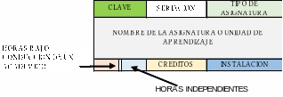
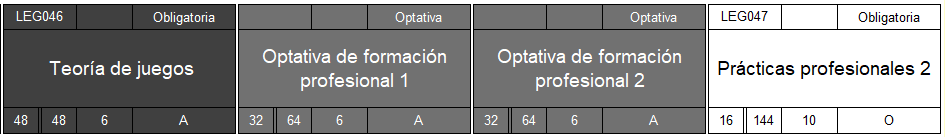
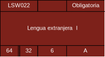
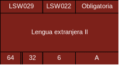
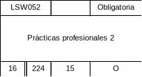
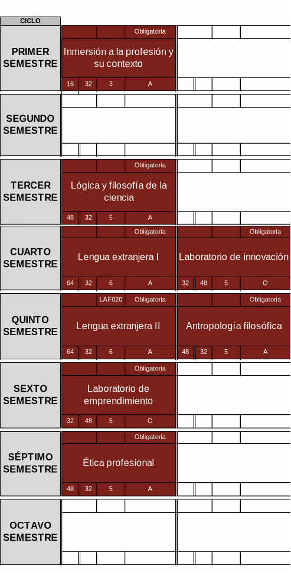

# Reglas de negocio Mapas Curriculares

## Especificaciones generales

### Clave

- La clave está compuesta por el **mnémónico del programa + número de posición de la asignatura en el mapa (tres cifras) de izquierda a derecha, arriba a abajo**
- El mnemónico lo otorga Estructura Académica, por lo que tiene que ser solicitado previamente.
- E.g. Licenciatura en Administración financiera = LAF + Número de posición de la asignatura en el mapa = LAF001
- Los espacios para las Optativas no llevan clave y la numeración continúa en la siguiente posición del mapa.

### Seriación

Se coloca la clave de la asignatura que es requerimiento cursar en algún ciclo previo, únicamente cuando está registrada con número romano.

### Tipo de asignatura

Obligatoria u Optativa. Todas son Obligatorias a excepción de las Optativas de formación profesional.

### Nombre de la asignatura

Se escribe en formato Oración.

E.g. Proyecto de innovación tecnológica ✅

Proyecto de Innovación Tecnológica ❌

### Horas bajo conducción de un académico e independientes

⚠️ Ver especificaciones en cada tipo de programa.

### Créditos

Fórmula para calcular los créditos: (Horas con docente + Horas independientes) *0.0625

### Instalación

- A: Aula
- L: Laboratorio
- O: Otro

### Modalidades

<table>
  <tr>
    <td>Escolarizada</td>
    <td>No escolarizada</td>
    <td>Mixta</td>
  </tr>
  <tr>
    <td>Opción presencial</td>
    <td>En línea o virtual; Abierta o a Distancia</td>
    <td>En línea o virtual; Abierta o a Distancia y Opción Dual</td>
  </tr>
</table>

## Licenciaturas

Duración: 8 semestres* (Checar excepciones como arquitectura, derecho y salud)

<table>
  <tr>
    <td rowspan="2"><strong>Créditos totales</strong></td>
    <td rowspan="2"><strong>Horas mínimas (bajo conducción docente e independientes)</strong></td>
    <td colspan="2"><strong>Modalidad escolarizada</strong></td>
    <td colspan="2"><strong>Modalidad no escolarizada</strong></td>
    <td colspan="2"><strong>Modalidad Mixta</strong></td>
  </tr>
  <tr>
    <td>Horas frente a docente</td>
    <td>Créditos frente a docente</td>
    <td>Horas frente a docente</td>
    <td>Créditos frente a docente</td>
    <td>Horas frente a docente</td>
    <td>Créditos frente a docente</td>
  </tr>
  <tr>
    <td>De 300 a 400</td>
    <td>4800</td>
    <td>2400</td>
    <td>150</td>
    <td>De 480 a 960</td>
    <td>De 30 a 60</td>
    <td>De 984 a 2376</td>
    <td>De 61.5 a 148.5</td>
  </tr>
</table>

\*IMPORTANTE: Los lineamientos de horas y créditos mínimos pueden cambiar en un futuro, necesitamos que puedan ser ajustables en caso de que esto ocurra.

<table>
  <tr>
    <td>Máximo de asignaturas por semestre</td>
    <td>7 asignaturas (mixta o escolarizada), 5 (no escolarizada)</td>
  </tr>
  <tr>
    <td>Máximo de créditos por semestre</td>
    <td>50 créditos</td>
  </tr>
</table>

### Asignaturas con orden preestablecido

Para el Decanato de Diseño, Ciencia y Tecnología:

Para el Decanato de Ciencias Sociales Económicas y Administrativas:

### Duración del ciclo y horas

El ciclo escolar tiene una duración de 16 semanas, por lo que las horas están en múltiplos de 16 dependiendo su frecuencia semanal:

Frecuencia 1 = 16 horas

Frecuencia 2 = 32 horas

### Asignaturas de núcleo

Para cada decanato, existen asignaturas de núcleo que cada programa debe incluir dentro de su malla curricular.

Para el Decanato de Diseño, ciencia y tecnología:

### Prácticas profesionales

Deberán incluirse mínimo dos semestres con prácticas profesionales, con mínimo de 320 horas y 20 créditos. O bien, máximo 5 periodos de práctica profesional en el que se incluye la estadía laboral, con un máximo de 1280 horas y 80 créditos.

### Asignaturas capstone

Se deben seleccionar dos asignaturas Capstone a partir de la segunda mitad del programa.

\*Hay excepciones a el número de semestres para algunos programas, como Derecho y arquitectura, pero se quiere una plantilla genérica y que se otorgue permiso para cualquier excepción.

## Posgrados

### Especialidades

<table>
  <tr>
    <td rowspan="2"><strong>Créditos totales</strong></td>
    <td rowspan="2"><strong>Horas mínimas (bajo conducción docente e independientes)</strong></td>
    <td colspan="2"><strong>Modalidad escolarizada</strong></td>
    <td colspan="2"><strong>Modalidad no escolarizada</strong></td>
    <td colspan="2"><strong>Modalidad Mixta</strong></td>
  </tr>
  <tr>
    <td>Horas frente a docente</td>
    <td>Créditos frente a docente</td>
    <td>Horas frente a docente</td>
    <td>Créditos frente a docente</td>
    <td>Horas frente a docente</td>
    <td>Créditos frente a docente</td>
  </tr>
  <tr>
    <td>De 45 a 54</td>
    <td>720</td>
    <td>180</td>
    <td>11.25</td>
    <td>De 36 a 72</td>
    <td>De 2.25 a 4.5</td>
    <td>De 73.8 a 178.2</td>
    <td>De 4.61 a 11.13</td>
  </tr>
</table>

Duración total: 3 ciclos (1 año) cuatrimestrales

Duración del ciclo: 14 semanas

### Maestrías

<table>
  <tr>
    <td rowspan="2"><strong>Créditos totales</strong></td>
    <td rowspan="2"><strong>Horas mínimas (bajo conducción docente e independientes)</strong></td>
    <td colspan="2"><strong>Modalidad escolarizada</strong></td>
    <td colspan="2"><strong>Modalidad no escolarizada</strong></td>
    <td colspan="2"><strong>Modalidad Mixta</strong></td>
  </tr>
  <tr>
    <td>Horas frente a docente</td>
    <td>Créditos frente a docente</td>
    <td>Horas frente a docente</td>
    <td>Créditos frente a docente</td>
    <td>Horas frente a docente</td>
    <td>Créditos frente a docente</td>
  </tr>
  <tr>
    <td>De 75 a 108  </td>
    <td>1200</td>
    <td>300</td>
    <td>18.75</td>
    <td>De 60 a 120</td>
    <td>De 3.75 a 7.5</td>
    <td>De 123 a 297</td>
    <td>De 7.68 a 18.56</td>
  </tr>
</table>

Duración total: 6 cuatrimestres (2 años)

Se cursan dos asignaturas al cuatrimestre

Duración del ciclo: 14 semanas

HORAS Y FRECUENCIAS:

Todas las asignaturas de maestrías tienen horas y créditos preestablecidos

Frecuencia 1 = 14 horas con docente

Horas independientes = 130 horas

Créditos= 9 créditos

Asignaturas con orden preestablecido:

Primer cuatrimestre: Liderazgo innovador para el desarrollo profesional

Sexto cuatrimestre: Proyecto aplicado

Debe llevar 2 Tópicos Selectos y 2 Optativas

### Doctorados

<table>
  <tr>
    <td rowspan="2"><strong>Créditos mínimos</strong></td>
    <td rowspan="2"><strong>Horas mínimas (bajo conducción docente e independientes)</strong></td>
    <td colspan="2"><strong>Modalidad escolarizada</strong></td>
    <td colspan="2"><strong>Modalidad no escolarizada</strong></td>
    <td colspan="2"><strong>Modalidad Mixta</strong></td>
  </tr>
  <tr>
    <td>Horas frente a docente</td>
    <td>Créditos frente a docente</td>
    <td>Horas frente a docente</td>
    <td>Créditos frente a docente</td>
    <td>Horas frente a docente</td>
    <td>Créditos frente a docente</td>
  </tr>
  <tr>
    <td>150</td>
    <td>2400</td>
    <td>600</td>
    <td>37.5</td>
    <td>De 120 a 240</td>
    <td>De 7.5 a 15</td>
    <td>De 246 a 594</td>
    <td>De 15.37 a 37.12</td>
  </tr>
</table>

Duración del ciclo: 14 semanas

## Optativas

\*En ocasiones, hay optativas con horas con académico e independientes menores al mínimo, de ser aprobado, se tiene que colocar en el mapa una optativa con ese mínimo de horas y en el listado, dicha asignatura tendrá en ciclo el semestre seleccionado en el mapa. Esto tiene que ser autorizado

Mínimo de horas en optativas de licenciatura mixta o escolarizada: 32 con académico / 64 independientes

Mínimo de horas en optativas de licenciatura online (no escolarizada): 64 con académico / 80 independientes

### Hoja “Optativas”

Para programas federales escolarizados o estatales de cualquier modalidad, se llena la hoja “Optativas”.

Estas optativas tienen que aparecer siempre en los programas de **Licenciatura**, al final del listado de optativas propias del programa:

- Inteligencia emocional
- Estrategias de aprendizaje
- Habilidades directivas
- Comunicación efectiva
- Hábitos de vida saludable
- Negociación
- Teoría de la gestión de proyectos
- El proyecto reflexivo: alinear el propósito con el enfoque
- Evaluación de proyectos y programas
- Liderando equipos integradores
- Administración de la contabilidad global
- Liderazgo para la toma de decisiones basada en datos
- Liderazgo global y desarrollo personal
- Administración y estrategia global de mercadotecnia
- Análisis de datos empresariales
- Programación para la inteligencia artificial y el análisis de datos empresarial
- Aprendizaje automático en los negocios
- Visualización de datos empresariales

CICLO: En el listado de optativas se colocan los semestres en los que está marcado que se puede tomar optativas en el mapa curricular.

### Hoja “Flexible”

Para programas federales mixtos o no escolarizados, se llena la hoja “Flexible”.

Se colocan en tablas organizadas por el área de formación de las asignaturas en lugar del ciclo.

En el apartado “Administración del plan de estudios” se coloca el siguiente texto:

El plan de estudios se diseñó bajo una trayectoria curricular flexible en modalidad no escolarizada. La organización de los contenidos es congruente con el perfil de egreso, de manera particular con el cumplimiento de las competencias profesionales que se diseñaron para el plan de estudios, por lo que no se tienen seriaciones en las asignaturas, debido a que están diseñadas de manera estratégica para llevar a los alumnos al cumplimiento de su perfil.

El plan de estudios se conjunta de un total de xx asignaturas obligatorias, consta de un total de xx horas de aprendizaje, de las cuales xx son en compañía de un académico y xx de estudio independiente, las horas anteriores se traducen en xx créditos obligatorios que deben cursar los alumnos en mínimo 6 cuatrimestres o máximo 9, cursando un mínimo de 1 asignatura y un máximo de 3 asignaturas por ciclo.

Para operar el plan de estudios, la UAG cuenta con instalaciones según su necesidad, en este caso al ser un programa no escolarizado cuenta con aulas virtuales, así como una plataforma educativa, en la que el alumno complementa su aprendizaje; también se tienen instalaciones especiales o espacios de práctica en donde se orienta al alumno a la solución de problemas donde deben aplicar el conocimiento adquirido en su plan de estudios.

## Solicitudes adicionales

- Colocar un menú desplegable para seleccionar el área de formación manualmente, ya que cambia por programa

Licenciaturas:

- Área de Formación Universitaria
- Área de Formación Básica
- Área de Formación Disciplinar
- Área de Formación Profesional

Posgrados:

- Área de Formación Fundamental
- Área de Formación Disciplinar
- Área de Formación Terminal de Investigación

- Colocar una opción para identificar una asignatura como de “Aporte sustancial” cuando sea necesario
- Cargar la información del docente sugerido para la asignatura
- Cargar tipo de aula
- Cargar el programa de asignatura de cada materia en el mapa
